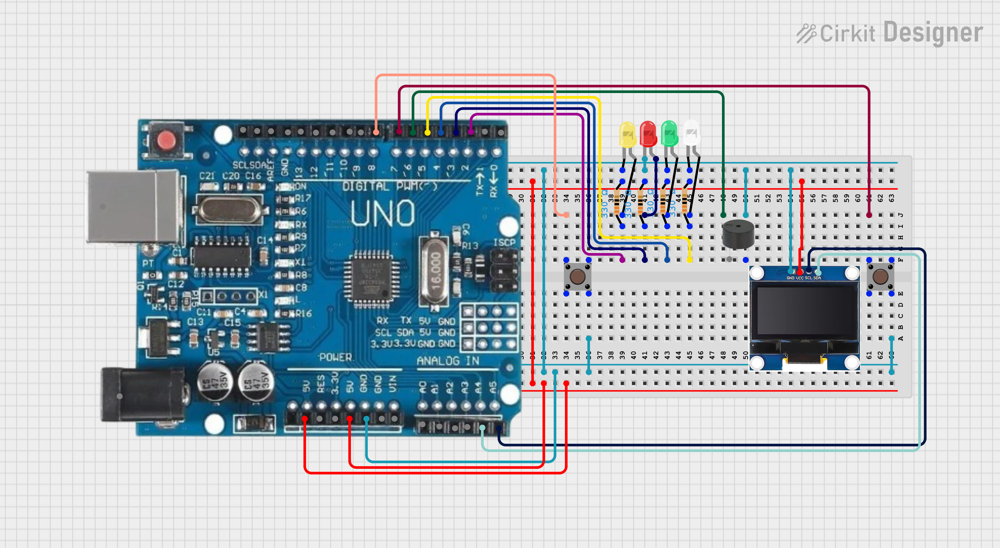
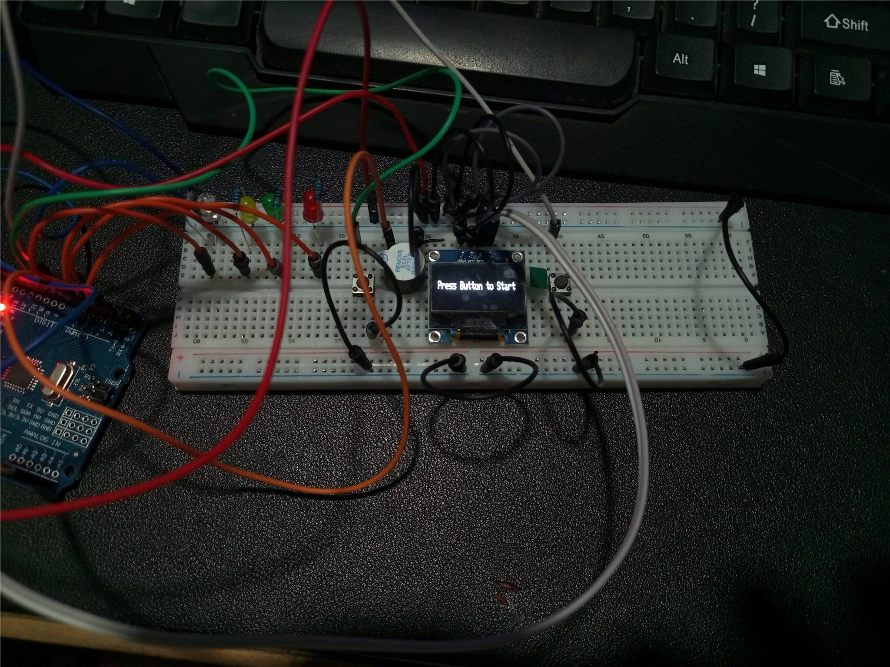
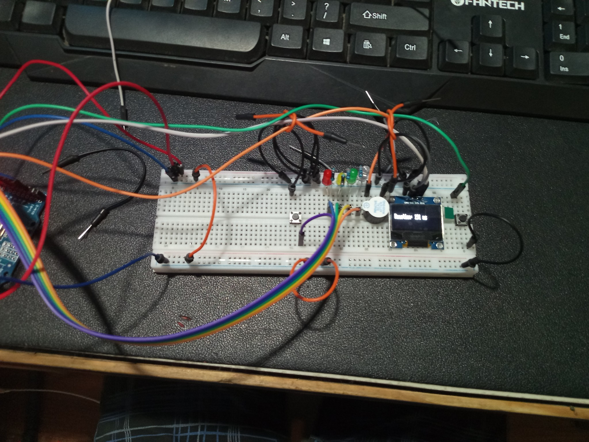

---

# 🕹️ Reaction-Test-OLED-Display

A fun and interactive **Arduino Reaction Timer Game** using an **SSD1306 128x32 OLED Display**, LEDs, buzzer, and buttons. Players test their reaction speed as they wait for the “Go!” signal before pressing the button. The OLED shows feedback and reaction time in milliseconds.

 



---

## ✨ Features

* 🧠 Reaction-based gameplay using LED and buzzer signals
* 🎨 “Ready, Set, Go!” LED sequence (White → Yellow → Green → Red)
* 🖥️ OLED SSD1306 128x32 display for visual instructions and reaction time
* 🔊 Buzzer sound indicators
* 🔁 Reset button for restarting the game
* 🕒 Accurate reaction time measurement in milliseconds

---

## 🧰 Technologies Used

* **Arduino UNO R3**
* **OLED SSD1306 128x32 Display (I2C)**
* **Adafruit SSD1306 & GFX Libraries**
* **C++ (Arduino IDE)**
* **Tactile pushbuttons, LEDs, buzzer**

---

## 🚀 Getting Started

### 1. **Circuit Setup**

| Component    | Arduino Pin |
| ------------ | ----------- |
| White LED    | D2          |
| Yellow LED   | D3          |
| Green LED    | D4          |
| Red LED      | D5          |
| Buzzer       | D6          |
| Game Button  | D7          |
| Reset Button | D8          |
| OLED SDA     | A4          |
| OLED SCL     | A5          |
| OLED VCC     | 5V          |
| OLED GND     | GND         |

Use **330Ω resistors** for all LEDs.

---

### 2. **Library Installation**

In Arduino IDE:

```
Sketch → Include Library → Manage Libraries…
Search and install:
- Adafruit SSD1306
- Adafruit GFX Library
```

---

### 3. **Upload the Code**

Upload the `.ino` file to your Arduino UNO.
Ensure your board and COM port are correctly set.

---

## 🕹️ Usage

1. Power on the Arduino.
2. Follow the LED sequence — White, Yellow, Green, then Red.
3. Wait for “GO!” to appear on the OLED and the buzzer to sound.
4. Press the game button **as fast as possible**!
5. Reaction time appears on the OLED.
6. Press the reset button to try again.

---

## 🧩 Project Structure

```
reaction-test-oled-display/
│
├── reaction-test-oled-display.ino   # Main Arduino sketch
├── /images/                         # Optional project images or wiring diagrams
└── README.md                        # Project documentation
```

---

## 📦 Packaging for Distribution

* Export your Arduino sketch folder (`Sketch → Show Sketch Folder`)
* Zip the folder and share it with your collaborators or upload it to GitHub

---

## 🔮 Future Enhancements

* Add difficulty modes (randomized LED sequence timing)
* Store high scores using EEPROM
* Display animation or countdown on OLED
* Add multiplayer mode (two buttons)

---

## 🧱 System Requirements

* Arduino UNO R3 (or compatible board)
* OLED SSD1306 128x32 Display
* 5V power supply
* Arduino IDE (v1.8.19 or newer)

---

## 🧰 Troubleshooting

| Issue                | Possible Cause        | Solution                         |
| -------------------- | --------------------- | -------------------------------- |
| OLED shows nothing   | SDA/SCL pins reversed | Check wiring (A4 SDA, A5 SCL)    |
| Buttons unresponsive | Floating input pins   | Use `pinMode(pin, INPUT_PULLUP)` |
| LEDs not lighting    | Wrong resistor or pin | Double-check LED wiring          |
| Buzzer too quiet     | Low current           | Use active buzzer                |

---

## 🙏 Acknowledgements

* **Adafruit** for SSD1306 & GFX libraries
* **Arduino Community** for example codes and tutorials
* Inspired by classic reaction timer arcade games
* app.cirkitdesigner.com
* Nooby 
* Firelink
* SBBC PC
* Rita's PC
* To my dog and cat

---

## ⚖️ License

This project is licensed under the **MIT License** — feel free to use, modify, and distribute.

---
